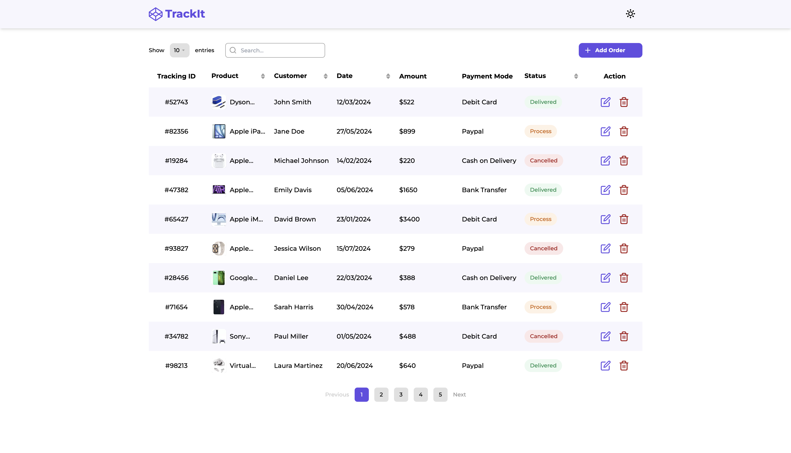
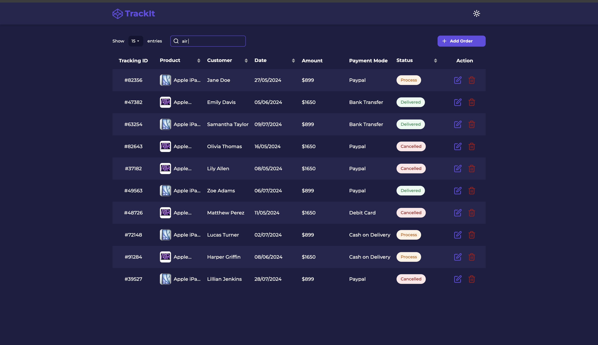

# TrackIt - application for simplifying parcel tracking

## Introduction

Welcome to TrackIt, the ultimate solution for effortless parcel tracking. This application is
designed to streamline the process of managing and tracking your parcels, making it easier for you
to stay informed about your shipments. Whether you're a business managing multiple shipments or an
individual tracking a single package, TrackIt provides a user-friendly interface and robust features
to enhance your tracking experience.

## Features

- **Limit Selection per Page:** Allows users to customize the number of orders displayed on each
  page for a more tailored view.
- **Pagination:** Implements pagination to efficiently navigate through large lists of tracked
  parcels.
- **Order Search:** Enables users to search for specific orders quickly using various search
  criteria.
- **Order Deletion:** Provides functionality to remove orders from the tracking list as needed.
- **Theme Switching:** Allows users to toggle between light and dark themes for a personalized and
  comfortable viewing experience.

## Screenshots

## Technologies Used:

